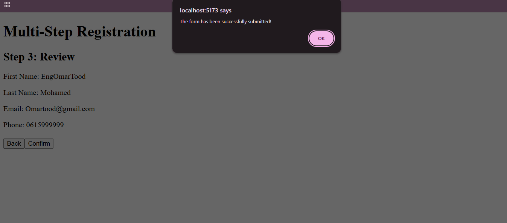

   ## React JS Exercise 14
  
  ***
  
  ## Developer Name: Eng Abdirahman Ai
  
  ***
  
  ## Group A
  
  ***
  
  [GitHub Link](https://github.com/engai2025/React-Exercise-13)
  
  ***
  
  ## Code
  
  ### App.jsx
  
  ```jsx
  
// import TodoApp from "./TodoApp";
import Exercise14 from "./Exercise-14";

function App() {
  return (
    <>
      {/* <TodoApp /> */}
      <Exercise14 />
    </>
  );
}

export default App;

  ```
  
  ### Exercise-14.jsx
  
  ```jsx
  // Exercise-14.jsx code
 
  import React, { useReducer } from "react";

 
const UPDATE_FIELD = "UPDATE_FIELD";
const NEXT_STEP = "NEXT_STEP";
const PREV_STEP = "PREV_STEP";
const RESET_FORM = "RESET_FORM"; 

 
const initialState = {
  step: 1,
  firstName: "",
  lastName: "",
  email: "",
  phone: "",
};
 
function reducer(state, action) {
  switch (action.type) {
    case UPDATE_FIELD:
      return {
        ...state,    [action.field]: action.value,
     
      };

    case NEXT_STEP:
      return {
        ...state,
        step: state.step < 3 ? state.step + 1 : state.step,
      };

    case PREV_STEP:
      return {
        ...state,
        step: state.step > 1 ? state.step - 1 : state.step,
      };

    case RESET_FORM:
      return initialState;

    default:
      return state;
  }
}

 
export default function MultiStepRegistration() {
  const [state, dispatch] = useReducer(reducer, initialState);

  const handleChange = (e) => {
    dispatch({
      type: UPDATE_FIELD,
      field: e.target.name,
      value: e.target.value,
    });
  };

  const handleSubmit = () => {
    alert("The form has been successfully submitted!");
    dispatch({ type: RESET_FORM }); 
  };

  const nextStep = () => dispatch({ type: NEXT_STEP });
  const prevStep = () => dispatch({ type: PREV_STEP });

 
  const Step1Profile = () => (
    <div>
      <h2>Step 1: Profile</h2>
      <div>
        <label>First Name:</label>
        <input
          name="firstName"
          value={state.firstName}
          onChange={handleChange}
        />
      </div>
      <div>
        <label>Last Name:</label>
        <input
          name="lastName"
          value={state.lastName}
          onChange={handleChange}
        />
      </div>
      <button onClick={nextStep}>
        Next
      </button>
    </div>
  );

 
  const Step2Contact = () => (
    <div>
      <h2>Step 2: Contact</h2>
      <div>
        <label>Email:</label>
        <input
          name="email"
          type="email"
          value={state.email}
          onChange={handleChange}
        />
      </div>
      <div>
        <label>Phone:</label>
        <input
          name="phone"
          type="tel"
          value={state.phone}
          onChange={handleChange}
        />
      </div>

      <button onClick={prevStep}>
        Back
      </button>
      <button onClick={nextStep}>
        Next
      </button>
    </div>
  );

 
  const Step3Review = () => (
    <div>
      <h2>Step 3: Review</h2>

      <p>First Name: {state.firstName}</p>
      <p>Last Name: {state.lastName}</p>
      <p>Email: {state.email}</p>
      <p>Phone: {state.phone}</p>
      
      <div style={{ marginTop: "20px" }}>
        <button onClick={prevStep}>
          Back 
        </button>
        <button onClick={handleSubmit}>
          Confirm
        </button>
      </div>
    </div>
  );


  return (
    <div>
      <h1>Multi-Step Registration</h1>

      {state.step === 1 && <Step1Profile />}
      {state.step === 2 && <Step2Contact />}
      {state.step === 3 && <Step3Review />}
    </div>
  );
}


  ```
  
   
  
   
  
  ## Output 1
  
  ***
 
  
  
  ## Output 2
  
  ***

  
  ## Output 3 The Result
  ***


  
  ## Output 4 The Alert pop up
  ***


  


 
 
  
  ***
  
  ## Programming Language Used
  
  ***
  
  | Programming Language | Framework | Database |
  |:--------------------|:----------|:---------|
  | React JS            | 0         | 0        |
  
  ***
  
  ## Task
  
  - [x] Done
  
  